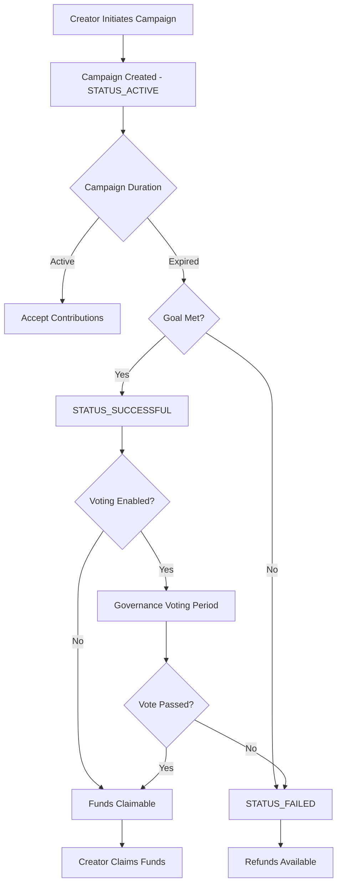

# CrowdVault: Next-Generation Blockchain Crowdfunding Platform

[](https://opensource.org/licenses/ISC)
[](https://clarity-lang.org/)
[](https://www.stacks.co/)

A revolutionary decentralized funding ecosystem that empowers innovation through community-driven investment and transparent project governance on the Stacks blockchain.

## 🚀 Overview

CrowdVault transforms traditional crowdfunding by leveraging Bitcoin's security through the Stacks blockchain, creating an immutable and trustless environment where creators and backers can engage with complete confidence. Built for the future of decentralized finance, CrowdVault eliminates traditional intermediaries while maintaining the highest standards of security and transparency.

## ✨ Core Features

- **🔍 Transparent Funding Campaigns** - Real-time progress tracking with immutable records
- **🗳️ Community-Driven Validation** - Weighted voting systems for project governance
- **⚡ Automated Fund Distribution** - Milestone-based smart contract execution
- **🛡️ Guaranteed Backer Protection** - Smart refund mechanisms for failed campaigns
- **⚙️ Flexible Configuration** - Customizable campaign parameters
- **🏛️ Decentralized Governance** - Fair project accountability without intermediaries

## 🏗️ System Architecture

### Contract Architecture

The CrowdVault smart contract is built with a modular architecture consisting of several key components:

```text
CrowdVault Smart Contract
├── Core Data Structures
│   ├── Campaign Registry
│   ├── Contribution Ledger
│   ├── Voting System
│   └── Contributor Directory
├── Public Functions
│   ├── Campaign Management
│   ├── Contribution Processing
│   ├── Fund Distribution
│   ├── Refund Mechanism
│   └── Governance Voting
├── Query Functions
│   ├── Campaign Information
│   ├── Contribution Details
│   └── Platform Statistics
└── Administrative Functions
    ├── Fee Management
    └── Emergency Controls
```

### Data Flow

#### Campaign Lifecycle



#### Contribution Flow


## 📋 Contract Specifications

### Campaign Parameters

| Parameter | Type | Description | Constraints |
|-----------|------|-------------|-------------|
| `title` | string-ascii 64 | Campaign title | 1-64 characters |
| `description` | string-ascii 256 | Campaign description | 1-256 characters |
| `goal` | uint | Funding goal in microSTX | > 0 |
| `duration-blocks` | uint | Campaign duration | 144-144000 blocks (~1-100 days) |
| `voting-enabled` | bool | Enable governance voting | true/false |
| `voting-duration-blocks` | uint | Voting period duration | ≤ 14400 blocks (~10 days) |
| `min-contribution` | uint | Minimum contribution amount | > 0 |

### Campaign States

| State | Value | Description |
|-------|-------|-------------|
| `STATUS_ACTIVE` | 1 | Campaign accepting contributions |
| `STATUS_SUCCESSFUL` | 2 | Goal met, funds claimable |
| `STATUS_FAILED` | 3 | Goal not met, refunds available |
| `STATUS_CANCELLED` | 4 | Campaign cancelled by creator/admin |

### Platform Limits

- **Maximum Campaign Duration**: 144,000 blocks (~100 days)
- **Maximum Voting Duration**: 14,400 blocks (~10 days)
- **Minimum Campaign Duration**: 144 blocks (~1 day)
- **Maximum Contributors per Campaign**: 500
- **Default Platform Fee**: 2.5% (configurable by admin)

## 🛠️ Development Setup

### Prerequisites

- [Clarinet](https://github.com/hirosystems/clarinet) - Stacks development environment
- [Node.js](https://nodejs.org/) v16+ - For running tests
- [Git](https://git-scm.com/) - Version control

### Installation

1. **Clone the repository**

   ```bash
   git clone https://github.com/steve-enoch/crowd-vault.git
   cd crowd-vault
   ```

2. **Install dependencies**

   ```bash
   npm install
   ```

3. **Verify setup**

   ```bash
   clarinet check
   ```

### Testing

Run the comprehensive test suite:

```bash
# Run all tests
npm test

# Run tests with coverage and cost analysis
npm run test:report

# Watch mode for development
npm run test:watch
```

Verify contract syntax and logic:

```bash
clarinet check
```

## 📚 API Reference

### Public Functions

#### Campaign Management

**`create-campaign`**

```clarity
(create-campaign 
  (title (string-ascii 64))
  (description (string-ascii 256))
  (goal uint)
  (duration-blocks uint)
  (voting-enabled bool)
  (voting-duration-blocks uint)
  (min-contribution uint)
) -> (response uint uint)
```

**`contribute`**

```clarity
(contribute 
  (campaign-id uint)
  (amount uint)
) -> (response bool uint)
```

**`claim-funds`**

```clarity
(claim-funds (campaign-id uint)) -> (response bool uint)
```

**`request-refund`**

```clarity
(request-refund (campaign-id uint)) -> (response bool uint)
```

**`vote`**

```clarity
(vote 
  (campaign-id uint)
  (vote-for bool)
) -> (response bool uint)
```

**`cancel-campaign`**

```clarity
(cancel-campaign (campaign-id uint)) -> (response bool uint)
```

### Read-Only Functions

**`get-campaign`**

```clarity
(get-campaign (campaign-id uint)) -> (optional campaign-data)
```

**`get-contribution`**

```clarity
(get-contribution 
  (campaign-id uint)
  (contributor principal)
) -> (optional contribution-data)
```

**`is-campaign-active`**

```clarity
(is-campaign-active (campaign-id uint)) -> bool
```

**`is-campaign-successful`**

```clarity
(is-campaign-successful (campaign-id uint)) -> bool
```

### Administrative Functions

**`set-platform-fee-rate`** (Owner only)

```clarity
(set-platform-fee-rate (new-rate uint)) -> (response bool uint)
```

**`emergency-pause-campaign`** (Owner only)

```clarity
(emergency-pause-campaign (campaign-id uint)) -> (response bool uint)
```

## 🔐 Security Features

### Smart Contract Security

- **Immutable Logic**: Core contract logic cannot be modified post-deployment
- **Access Controls**: Role-based permissions for administrative functions
- **Input Validation**: Comprehensive parameter validation and bounds checking
- **Reentrancy Protection**: Safe state updates before external calls

### Financial Security

- **Escrow Mechanism**: Funds held securely in contract until conditions are met
- **Automatic Refunds**: Smart contract enforced refund mechanism for failed campaigns
- **Fee Transparency**: Clear platform fee structure with configurable rates
- **Vote-Weighted Governance**: Democratic decision making for fund release

## 🤝 Contributing

We welcome contributions to improve CrowdVault! Please read our [Contributing Guidelines](CONTRIBUTING.md) before submitting pull requests.

### Development Workflow

1. Fork the repository
2. Create a feature branch
3. Implement changes with tests
4. Run the full test suite
5. Submit a pull request

## 📄 License

This project is licensed under the ISC License - see the [LICENSE](LICENSE) file for details.

## 🔗 Links

- **Documentation**: [Stacks Documentation](https://docs.stacks.co/)
- **Clarity Language**: [Clarity Reference](https://clarity-lang.org/)
- **Stacks Blockchain**: [Stacks.co](https://www.stacks.co/)
- **Community**: [Stacks Discord](https://discord.gg/stacks)

## 📧 Support

For questions, issues, or contributions:

- Open an issue on GitHub
- Join the Stacks community Discord
- Check the documentation for detailed guides

---

**CrowdVault** - Democratizing innovation through decentralized crowdfunding 🚀
